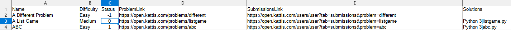

# KattisToGithub
KattisToGithub (KTG) is a Python 3 application that allows you to easily transfer your most recent accepted submissions for solved problems on [Open.Kattis](https://open.kattis.com/) to a Github repository.

Here are the basic steps KTG takes to make showing off your solutions and programming skills easier:
1. Logs into your [Open.Kattis](https://open.kattis.com/) profile
2. Fetches the contents of the "Solved problems" tab on your profile
3. Download's the most recent accepted submission for each problem
4. Creates a list of all solved problems to your repository's README.md
5. Uses _git add_ and _git commit_ on the downloaded files and README.md

All you have to do is run KTG and use the command _git push_ once KTG has finished!

You can find my Kattis solutions repository, maintained by KattisToGithub, [here](https://github.com/Zabrakk/Kattis-Solutions).

## Getting Started

### Installation
In order to install KTG, follow these steps:
1. Clone this repository:
```bash
git clone https://github.com/Zabrakk/KattisToGithub.git
```
2. Install the required dependencies:
```bash
cd KattisToGithub
pip install -r requirements.txt
```

### Running KattisToGithub for the first time
At this point KTG can be run. However, note that you need a repository into which the KTG wll download your solutions. **If you don't yet have a repository ready, go ahead and create one**.

Now, for the sake of giving an example, let's assume that you have a repository named **KattisSolutions**, and this repository is stored locally on your machine in the same parent directory as KTG like this:
```
home
|-KattisToGithub
|-KattisSolutions
```
To start downloading your Kattis submission into KattisSolutions you can run KTG with the following command:
```bash
python KattisToGithub.py -u <username> -p <password> -d ../KattisSolutions
```
Substitute \<username\> and \<password\> with the details you use with Kattis' "[Log in with e-mail](https://open.kattis.com/login/email?)".

Depending on how many problems you have solved KTG may take a while to run. However, after it has finished remember to _git push_ any commits KTG made. And thats it!

## Updating already downloaded solutions
In the case that you end up updating your solution to any problem that has already been downloaded by KTG, you can make KTG redownload and commit this new solution. KTG creates a file called **_status.csv_** where it stores information about solved problems. From there you can find the problem you have updated and change the value of its "Status" column to 0. An example of this can be seen in the image below.



Now, when KTG is run again, the newest submission for that problem will be fetched.

The possible status codes for **_status.csv_** are as follows:
```python
CODE_FOUND = 1
UPDATE = 0
CODE_NOT_FOUND = -1
```

## Command line arguments
KattisToGithub has the following command line arguments:
```
usage: KattisToGithub.py [-h] -u  -p  -d  [--no-git] [--no-readme] [--py-main-only]

optional arguments:
  -h, --help         show this help message and exit
  -u , --user        Kattis username or email.
  -p , --password    Kattis password.
  -d , --directory   Directory to which Kattis solution are downloaded to.
  --no-git           If this argument is given, Git add and commit will not be used on any files.
  --no-readme        If this argument is given, KTG will not modify the repository's README.md in any way.
  --py-main-only     If this argument is given, KTG only downloads Python 3 files that include the substring "def main()".
```
The last argument (_--py-main-only_) is something I added because I don't want to share the very short and messy solutions I have written for some problems :)


## Running tests
You can run the unittests with:
```bash
./run_utest.sh
```
By default unittests marked with the _@use_test_credentials_ decorator are skipped. These tests actually log into Kattis and fetch details from there. In order to also run the skipped tests, add a file called _test_credentials.txt_ to the test folder. The contents of this file should include two lines for your Kattis username and password:
```
username
password
```